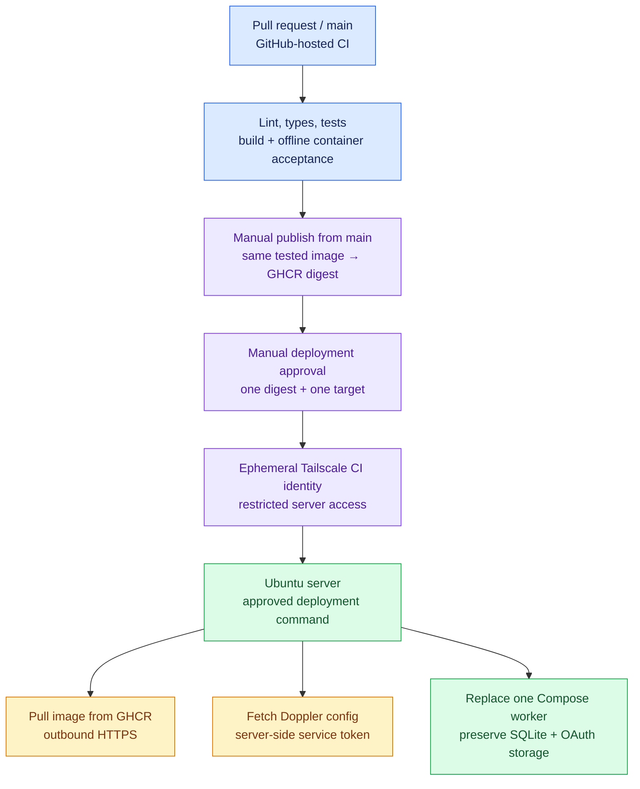

# Deployment checklist

Working plan for **7 October 2026**. Branch: `codex/deployment-readiness`.
This checklist covers deployment and debugging; no production activation has occurred.

## Target and verified starting point

Use one Docker Compose worker, local persistent SQLite and Doppler-managed app/model secrets. Docker owns worker restarts; no reverse proxy or inbound application port is needed. GitHub-hosted runners build/test the image; Tailscale supplies the private deployment connection.

Read-only server inspection confirmed Ubuntu 26.04 LTS, x86_64, Docker 29.7.2, Compose 5.5.0, synchronized host time, Docker enabled at boot, UFW enabled with LAN SSH access, and an online Tailscale client. There is ample local disk/RAM for this worker. HTTPS endpoints for GHCR, Doppler and Lark respond; credentials and API permissions are still separate checks. Doppler CLI was not found on the server. No existing service or firewall setting was changed.

The repository is public. Keep ordinary PR checks on GitHub-hosted runners; do not give PR jobs a production-server runner, Docker socket, deployment identity or real task data. Password SSH is sufficient for today's inspection, but automation should use a restricted deployment identity rather than the administrator's password.

## Why the private network does not prevent CI/CD

The server pulls its image over HTTPS. We do not need to SCP application source or expose LAN SSH publicly. A GitHub runner temporarily joins the approved tailnet and invokes the deployment command at the server's Tailscale address. Only the deployment job gets this access, never ordinary PR CI. Installing Tailscale directly on the server avoids routing GitHub into the rest of the office LAN. [Tailscale Actions integration](https://github.com/tailscale/github-action)

If tailnet setup is delayed, use the same tested image with a manual LAN-side pull and deployment. A self-hosted runner can also use outbound GitHub connections, but a persistent runner on this shared production host would add unnecessary exposure for a public repository. [GitHub runner requirements](https://docs.github.com/en/actions/reference/runners/self-hosted-runners)

## Step-by-step work

### 1. Establish the baseline

- [x] Create the deployment branch from merged main, including Pino instrumentation.
- [x] Verify the SSH host against the existing known-host entry and inspect the server without changes.
- [x] Verify OS/architecture, Docker/Compose, disk/RAM, boot, clock, firewall and Tailscale state.
- [x] Confirm repository visibility and absence of existing Actions workflows.
- [x] Run local release verification: lint/types/build pass; source regression **443 passed, 22 optional cases skipped**; full Docker acceptance **24 passed**, including the predecessor upgrade/rollback drill.
- [x] Build `task-list-local:deployment-readiness` and preserve `task-list-local:ai-7` for the local upgrade drill. These are local images; the deployable GHCR digest still awaits publication.

### 2. Put CI and image publishing in place

- [x] Draft `.github/workflows/ci.yml`: PR/main/manual source checks plus offline container acceptance, with read-only permissions and no real credentials.
- [x] Draft `.github/workflows/publish-image.yml`: manual main-only verification, build, acceptance and publication of the same image to GHCR, followed by a digest in the run summary.
- [x] Validate all three workflows with actionlint; verify official action pins and exercise their local release commands.
- [ ] Merge after review and observe actual hosted runs.
- [ ] Require the CI check for merging main if repository administration settings permit.
- [ ] Run the manual publisher on the reviewed main commit.
- [ ] Choose package visibility. GHCR initially creates private packages; a public source repository does not automatically make its container anonymously pullable.
- [ ] If private, provision a read-only registry credential on the server using password-stdin/credential storage; do not expose it in shell history or Actions logs.
- [ ] Confirm a digest pull on the server; keep the old image until the upgrade is accepted.

The workflows are initial infrastructure, not an activation mechanism. Ordinary image acceptance skips the optional predecessor rollback case unless a predecessor image is supplied; rehearse that case before a real upgrade. [GHCR authentication and digest pulls](https://docs.github.com/en/packages/working-with-a-github-packages-registry/working-with-the-container-registry)

### 3. Authorize private deployment connectivity

- [x] Confirm the server is already enrolled and healthy in Tailscale.
- [x] Confirm the user has tailnet admin access.
- [ ] Select a tagged server identity and a distinct ephemeral CI tag; grant the CI identity access only to this server's deployment SSH port.
- [ ] Configure Tailscale workload identity federation for this repository/environment, or a scoped OAuth client if federation is unavailable. Record the exact branch/workflow restrictions.
- [ ] Configure the GitHub deployment environment, required review where supported, and deployment concurrency without cancellation of an active replacement.
- [ ] Provision a dedicated SSH deployment key/account or approved Tailscale SSH policy. Use pinned server host keys for ordinary SSH; no `StrictHostKeyChecking=no` and no administrator password in GitHub secrets.
- [ ] Restrict the account to the reviewed deployment helper. Docker group membership is effectively host-root access; it is not a restricted deployment role.
- [ ] Confirm UFW permits only the intended Tailscale path as needed, preserving LAN SSH and every existing service rule. Tailnet grants and host firewall rules are separate checks.
- [ ] Prove runner → server connectivity with a harmless read-only command before any deployment.

Keep Tailscale off the app container: it belongs on the host and ephemeral deploy runner. Tailnet administrator setup is still required even though the server is already online. No subnet router, router port forward or public SSH endpoint is planned.

### 4. Prepare persistent storage and Doppler

- [ ] Install/verify Doppler CLI on the server with the operator's approved package method.
- [x] Authenticate in workspace **mbeka02**, create project **task-list**, and create Preview **`prv`**. This repository selects `task-list/prv`; default `prd` remains unused.
- [ ] Create a read-only `prv` service token and install it privately on the server; provision production separately.
- [ ] Add `LARK_APP_SECRET` to `task-list/prv` through the dashboard and verify its presence without displaying it. Preview does not need a model key; provision that separately for publication. Keep runtime settings in reviewed configuration and never forward the Doppler token into Docker.
- [ ] Prepare private ledger, credential and backup directories, owned by the tested container UID/GID, plus the reviewed calendar file.
- [ ] Provision the separate worker OAuth grant and verify initial access and renewal. Do not copy the interactive CLI refresh token or restore an old rotating token.
- [x] Prepare the explicit server Compose definition: pinned image, bridge egress, no ports, read-only root, non-root user, bounded resources/logs and persistent mounts.
- [ ] Validate configuration quietly; do not print expanded configuration or secret values.
- [ ] Fetch Doppler secrets before changing a running worker; keep `--no-fallback` initially. Existing containers can restart without contacting Doppler.

The reviewed host paths, setup commands and GitHub/Tailscale settings are in [deploy/README.md](deploy/README.md). Deploy secrets stay on the host; GitHub only needs its deployment identity and target image reference.

### 5. Implement the deployment boundary with TDD

- [x] Agree the public deployment command before its first test, per the installed TDD skill.
- [x] Implement one serialized, validated image replacement: fetch secrets/pull/check first, graceful stop, previous-release consistent backup, replacement, then read-only readiness inspection.
- [x] Prove invalid images/configuration, failed fetch/pull and overlapping deployments leave the current worker alone.
- [x] Prove container replacement preserves ledger IDs, send UUIDs, acknowledged deliveries and the writable OAuth directory.
- [x] Prove failed readiness leaves a visible failure and never automatically restores stale data, clears restore markers or resends uncertain deliveries.
- [x] Wire a main-only manual deploy workflow to that tested helper over Tailscale. Deploy by digest; do not accept arbitrary shell commands or image repositories from inputs.
- [x] Emit safe structured host audit events with run ID, digest, actor UID, duration and outcome; return the backup reference in result JSON. GitHub records the initiating actor and reviewed commit/digest.

The preview helper and restricted SSH boundary are implemented and tested locally. Bash/Node syntax, Python execution and the sudoers template pass; actual host installation, effective SSH settings and hosted deployment remain pending.

### 6. Deploy preview and debug the actual server entry point

- [ ] Start one server preview worker with outbound disabled and brief publishing disabled.
- [ ] Verify startup logs, current Nairobi date, scope, calendar coverage and local state through the built status command.
- [ ] Run an approved source-history read/capture and explain any blocked or ambiguous submissions.
- [ ] Verify private OAuth renewal and mounted-file ownership in the actual runtime.
- [ ] Verify graceful stop/restart; do not reboot this shared server without coordinating existing services.
- [ ] Check stderr operational logs separately from stdout command results; confirm the ten-minute heartbeat and no sensitive content.
- [ ] Set off-server backup destination, owner and retention; perform backup and isolated paused restore.

### 7. Enable the live workflow safely

- [ ] Agree the production CLI seam and add tests before changing activation behavior.
- [ ] Wire the existing app-bot delivery transport, selected generator, private Doc publisher and approved scope into the worker CLI.
- [ ] Reject placeholders/unapproved destinations, missing model credentials and unsafe publishing settings before mutations.
- [ ] Verify source reader membership, reminder bot eligibility, test destination, native Doc scopes/folder/privacy and editor access.
- [ ] Prove names report + Doc/link in the development test group through the real deployed entry point, with separately approved content/model data processing.
- [ ] Confirm management-group ID/access, production data-processing approval, activation dates and reviewed Kenyan holidays.
- [ ] Activate the approved production destination; keep the manual report fallback and document rollback/reconciliation.

**Current blocker:** the worker CLI deliberately rejects `ENABLE_OUTBOUND=true` and `BRIEF_MODE=publish`. The underlying library flow exists, but a deployed preview image cannot send or publish merely by changing environment settings. The demo scripts are not a service entry point.

### 8. Operational acceptance

- [ ] Agree expected completion grace and an actionable alert recipient/backend.
- [ ] Observe a working-day reminder, names report, brief and their durable acknowledgements.
- [ ] Check that a retry/restart does not generate another report UUID or overwrite a published human-edited Doc.
- [ ] Rehearse reviewed rollback without reverting the ledger automatically.
- [ ] Hand over the runbook, calendar/backup owners, Doppler/Tailscale renewal procedure and incident contact.

## Next decisions

The off-server backup location, tailnet CI identity/policy and production CLI seam remain open. The restricted deployment account is approved and tested, but still needs host installation. The default recommendation is development-test-group acceptance before management activation. Passwords, private keys, grants and service tokens must never be copied into this checklist.

See [RUNBOOK.md](RUNBOOK.md) for current commands, frozen-delivery recovery and backup/restore behavior.
