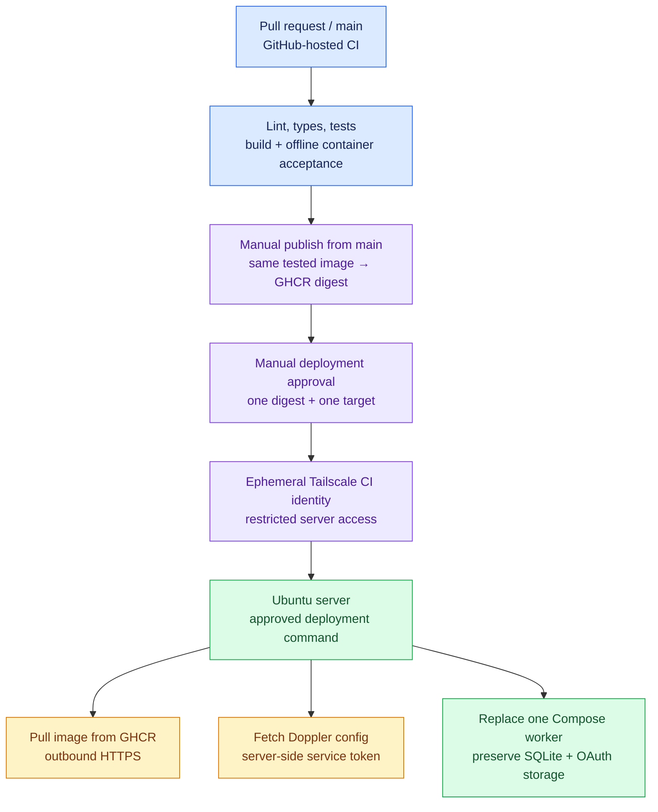

# Deployment checklist

Working plan updated **8 October 2026**. Current branch: `codex/live-activation`; earlier checklist steps record the reviewed preview deployments.
This checklist covers deployment and debugging. Production activation passed on 8 October; scheduled work starts 9 October. Earlier sections preserve preview-stage evidence.

## Target and verified starting point

Use one Docker Compose worker, local persistent SQLite and Doppler-managed app/model secrets. Docker owns worker restarts; no reverse proxy or inbound application port is needed. GitHub-hosted runners build/test the image; Tailscale supplies the private deployment connection.

Read-only server inspection confirmed Ubuntu 26.04 LTS, x86_64, Docker 29.7.2, Compose 5.5.0, synchronized host time, Docker enabled at boot, UFW enabled with LAN SSH access, and an online Tailscale client. There is ample local disk/RAM for this worker. HTTPS endpoints for GHCR, Doppler and Lark respond; credentials and API permissions are still separate checks. Doppler CLI was initially absent and is now installed. The restricted deployment account, root-owned helper, private persistent paths and SSH policy are now installed. Existing administrator logins and shared applications were preserved; the firewall was unchanged.

The repository is public. Keep ordinary PR checks on GitHub-hosted runners; do not give PR jobs a production-server runner, Docker socket, deployment identity or real task data. Password SSH is sufficient for today's inspection, but automation should use a restricted deployment identity rather than the administrator's password.

## Why the private network does not prevent CI/CD



The server pulls its image over HTTPS. We do not need to SCP application source or expose LAN SSH publicly. A GitHub runner temporarily joins the approved tailnet and invokes the deployment command at the server's Tailscale address. Only the deployment job gets this access, never ordinary PR CI. Installing Tailscale directly on the server avoids routing GitHub into the rest of the office LAN. [Tailscale Actions integration](https://github.com/tailscale/github-action)

If tailnet setup is delayed, use the same tested image with a manual LAN-side pull and deployment. A self-hosted runner can also use outbound GitHub connections, but a persistent runner on this shared production host would add unnecessary exposure for a public repository. [GitHub runner requirements](https://docs.github.com/en/actions/reference/runners/self-hosted-runners)

## Step-by-step work

### 1. Establish the baseline

- [x] Create the deployment branch from merged main, including Pino instrumentation.
- [x] Verify the SSH host against the existing known-host entry and inspect the server without changes.
- [x] Verify OS/architecture, Docker/Compose, disk/RAM, boot, clock, firewall and Tailscale state.
- [x] Confirm repository visibility and absence of existing Actions workflows.
- [x] Run local release verification: lint/types/build pass; source regression **443 passed, 22 optional cases skipped**; full Docker acceptance **24 passed**, including the predecessor upgrade/rollback drill.
- [x] Build `task-list-local:deployment-readiness` and preserve `task-list-local:ai-7` for the local upgrade drill. A separately tested GHCR image is now published; see the release evidence below.

### 2. Put CI and image publishing in place

- [x] Draft `.github/workflows/ci.yml`: PR/main/manual source checks plus offline container acceptance, with read-only permissions and no real credentials.
- [x] Draft `.github/workflows/publish-image.yml`: manual main-only verification, build, acceptance and publication of the same image to GHCR, followed by a digest in the run summary.
- [x] Validate all three workflows with actionlint; verify official action pins and exercise their local release commands.
- [x] Observe the first hosted PR CI run: all verification passed.
- [x] Merge reviewed deployment PR #19; merged-main CI passed.
- [ ] Require the CI check for merging main if repository administration settings permit.
- [x] Run the manual publisher on the reviewed main commit; source checks, offline container acceptance and image push passed.
- [x] Choose **public** package visibility, as approved by the owner. GHCR initially creates private packages; a public source repository does not automatically make its container anonymously pullable.
- [x] Apply public visibility and verify anonymous manifest access for the exact release digest (HTTP 200). No registry credential has been installed on the host.
- [x] Confirm anonymous digest pull on the server and inspect its amd64 architecture and reviewed source revision; keep predecessor images for later upgrades.

The workflows are initial infrastructure, not an activation mechanism. Ordinary image acceptance skips the optional predecessor rollback case unless a predecessor image is supplied; rehearse that case before a real upgrade. [GHCR authentication and digest pulls](https://docs.github.com/en/packages/working-with-a-github-packages-registry/working-with-the-container-registry)

**Release evidence:** reviewed main commit `4becb16a52edd4c8e875266a8823d54b5044bb89`; [main CI](https://github.com/mbeka02/task-list-submission-automation/actions/runs/37598819450) and [tested-image publisher](https://github.com/mbeka02/task-list-submission-automation/actions/runs/37599212543) both succeeded. Published image:

```text
ghcr.io/mbeka02/task-list-submission-automation@sha256:5caa5911747bb5246c279988940348d93eb84d3ad5bfca266799025ff21be8bb
```

Publication, anonymous manifest access and the host digest pull are verified. The host image label matches the reviewed main commit.

### 3. Authorize private deployment connectivity

- [x] Confirm the server is already enrolled and healthy in Tailscale.
- [x] Confirm the user has tailnet admin access.
- [x] Confirm the server now carries `tag:task-list-server` and administrator SSH still works through Tailscale.
- [ ] Verify the effective CI grant excludes unrelated devices/ports during the first runner check; tags/grants were configured by the tailnet administrator.
- [x] Configure Tailscale workload identity federation for this repository/environment and record the required branch/workflow restrictions; enrollment passed and negative claim tests remain outstanding.
- [x] Configure GitHub `preview` with a required `mbeka02` review, a main-only branch rule and non-cancelling deployment concurrency. Save `DEPLOY_HOST`, `TS_CLIENT_ID` and `TS_AUDIENCE` as environment variables.
- [x] Tailnet administrator reports completing the narrowed credential, tag and access-rule setup.
- [x] Prove the reviewed main workflow's OIDC identity is accepted through a successful check-only run. Inspect/test rejection of other subjects/custom claims separately; positive acceptance alone does not verify those restrictions.
- [x] Install the dedicated `task-list-deploy` account/key; keep its private key and verified host key only in GitHub `preview` secrets. Administrator passwords are not in Actions.
- [x] Verify effective SSH settings, host sudoers and real account behavior: check succeeds; shell/injection/mutable-tag/forwarding/unrelated-sudo attempts are denied. No Docker group membership.
- [x] Confirm the existing UFW SSH rule on `tailscale0`; preserve LAN SSH and all existing service rules. Tailnet grants remain a separate restriction.
- [x] Add a default **check-only** workflow mode using the approved SSH `check` command; no digest or worker replacement is needed.
- [x] Run it from reviewed main and prove GitHub runner → server connectivity before deployment: enrollment, restricted SSH check and cleanup all passed.

The [check-only run](https://github.com/mbeka02/task-list-submission-automation/actions/runs/37599009377) now succeeds. Earlier attempts failed first with auth-key creation HTTP 404 (Auth Keys write permission was missing), then HTTP 400 (the requested CI tag was not permitted). The administrator corrected the scope and allowed tag; enrollment and restricted SSH subsequently passed. This verifies the accepted runner identity and positive connectivity, but not rejection of other subjects/devices/ports. No worker replacement was attempted. See [enrollment troubleshooting](deploy/README.md#troubleshoot-runner-enrollment).

Keep Tailscale off the app container: it belongs on the host and ephemeral deploy runner. Tailnet administrator setup is still required even though the server is already online. No subnet router, router port forward or public SSH endpoint is planned.

### 4. Prepare persistent storage and Doppler

- [x] Install Doppler CLI 3.76.6 on the server through the official signed APT repository and verify its version.
- [x] Authenticate in workspace **mbeka02**, create project **task-list**, and create Preview **`prv`**. This repository selects `task-list/prv`; `prd` has a secret but no production deployment is active.
- [x] Install the read-only `prv` service token privately on the server and verify its secret fetch. Preview token expires **6 November 2026**; rotate before expiry. Production remains separate.
- [x] Verify `LARK_APP_SECRET` presence without displaying it in `task-list/prv` (also confirmed in dev/stg/prd). Preview does not need a model key; provision that separately for publication. Keep runtime settings in reviewed configuration and never forward the Doppler token into Docker.
- [x] Install root-owned release tooling/settings and private ledger, credential and backup directories owned by UID/GID 1000. Settings remain paused with preview activation date **8 October 2026**.
- [x] Install the owner-approved **paused-preview-only** calendar for 7–31 October 2026, listing 10 October (Mazingira) and 20 October (Mashujaa). Additional gazetted holidays were not exhaustively verified; this calendar is not approved for live work. Replace/review it before unpausing and extend coverage before November.
- [x] Complete corrected-scope worker consent and verify initial source access. The first grant lacked `im:message:readonly` and failed with code `99991679`; the independently issued replacement is installed privately, and the deployed SDK completed today's bounded history read (18 messages). Live renewal remains a separate unchecked item below. Do not copy the interactive CLI refresh token or restore an old rotating token.
- [x] Prepare the explicit server Compose definition: pinned image, bridge egress, no ports, read-only root, non-root user, bounded resources/logs and persistent mounts.
- [x] Validate configuration through deployment preflight/disposable-storage checks without printing expanded configuration or secret values.
- [x] Verify server-side Doppler fetching with the scoped token and `--no-fallback`, without displaying the secret. The paused preview now uses this path.

The reviewed host paths, setup commands and GitHub/Tailscale settings are in [deploy/README.md](deploy/README.md). Deploy secrets stay on the host; GitHub only needs its deployment identity and target image reference.

### 5. Implement the deployment boundary with TDD

- [x] Agree the public deployment command before its first test, per the installed TDD skill.
- [x] Implement one serialized, validated image replacement: fetch secrets/pull/check first, graceful stop, previous-release consistent backup, replacement, then read-only readiness inspection.
- [x] Prove invalid images/configuration, failed fetch/pull and overlapping deployments leave the current worker alone.
- [x] Prove container replacement preserves ledger IDs, send UUIDs, acknowledged deliveries and the writable OAuth directory.
- [x] Prove failed readiness leaves a visible failure and never automatically restores stale data, clears restore markers or resends uncertain deliveries.
- [x] Wire a main-only manual deploy workflow to that tested helper over Tailscale. Deploy by digest; do not accept arbitrary shell commands or image repositories from inputs.
- [x] Emit safe structured host audit events with run ID, digest, actor UID, duration and outcome; return the backup reference in result JSON. GitHub records the initiating actor and reviewed commit/digest.

The preview helper and restricted SSH boundary are implemented and tested locally. Bash/Node syntax, Python execution and the sudoers template pass; host installation and effective SSH settings are verified. Image publication, public access, hosted connectivity and paused worker deployment passed. The server's sudo-rs rejected the legacy argument wildcard; the fixed-executable rule passed host validation, with exact arguments enforced by the wrapper/helper. Its existing `AllowUsers` list was extended without removing existing users.

### 6. Deploy preview and debug the actual server entry point

- [x] Deploy the tested digest through the [successful preview deployment run](https://github.com/mbeka02/task-list-submission-automation/actions/runs/37602116560), following the owner's GitHub environment approval.
- [x] Start one server preview worker with **restore mode enabled**, outbound disabled and brief publishing disabled. Built status returns `paused` / `restore_review_required`; this is intentional, not a failed deployment.
- [x] Verify startup logs and built read-only status: Nairobi business date 7 October 2026, empty report/brief state and no backfill; verify UID 1000, read-only container root, no published ports, persistent ledger/credential mounts and read-only calendar mount.
- [x] Verify a bounded source-history read through the deployed SDK using the worker's own grant (18 messages, complete). This verifies access, not task-list evaluation or report capture; the paused scheduler has not frozen or sent reports.
- [x] Verify mounted OAuth-file ownership and permissions in the replacement runtime (UID 1000, mode 0600).
- [ ] Verify live OAuth renewal through the actual runtime; initial history access does not prove refresh-token rotation.
- [x] Verify graceful stop (exit 0) and restart; status stays paused and SQLite integrity/empty business-table counts persist. No shared-server reboot.
- [x] Inspect startup/status Pino events with run ID, entry point, timing and paused outcome; command-result JSON remains distinct and inspected logs contain no task content or credentials.
- [ ] Observe the ten-minute heartbeat on the deployed worker.
- [x] Exercise the built online backup command on the running server and restore to a separate file. Both return success, restored SQLite passes `quick_check`, and the restore-review marker is present. The active ledger was not replaced.
- [ ] Set off-server backup destination, owner, schedule and retention. The acceptance snapshot/restore are local files, not an off-server backup policy.

### 7. Enable the live workflow safely

- [x] Agree and test the production CLI, durable OAuth refresh and host-deployment seams.
- [x] Wire explicitly activated production publishing and separately scoped app-bot/webhook transports into the CLI; preview remains outbound-disabled.
- [ ] Reject placeholders/unapproved destinations, missing model credentials and unsafe publishing settings before mutations.
- [ ] Verify source reader membership, reminder bot eligibility, test destination, native user Doc scopes/folder/privacy and viewer access.
- [ ] Prove names report + Doc/link in the development test group through the real deployed entry point, with separately approved content/model data processing.
- [ ] Verify the private operator/admin reports group, its signed webhook and group viewer access, activation dates and reviewed Kenyan holidays. Ongoing Gemini task-text processing is approved.
- [ ] Activate the approved production destination; keep the manual report fallback and document rollback/reconciliation.

**Current gates:** local production/webhook implementation is ready for review, but the server still runs the old paused preview. Live canonical OAuth renewal, fresh Doc-enabled consent/folder, the report endpoint, view-only Doc access and calendar activation remain unverified. The source reminder endpoint passed its approved synthetic test and one bot message was verified. Direct-admin messaging was rejected by the tenant boundary; the chosen route is a private reports group with a custom webhook bot.

### 8. Operational acceptance

- [ ] Agree expected completion grace and an actionable alert recipient/backend.
- [ ] Observe a working-day reminder, names report, brief and their durable acknowledgements.
- [ ] Check that a retry/restart does not generate another report UUID or overwrite a published human-edited Doc.
- [ ] Rehearse reviewed rollback without reverting the ledger automatically.
- [ ] Hand over the runbook, calendar/backup owners, Doppler/Tailscale renewal procedure and incident contact.

## Next decisions

The paused preview is running. Live OAuth renewal, production endpoint/Doc access and calendar acceptance remain open; off-server backups are explicitly deferred by the owner; negative tailnet/identity-policy checks also remain outstanding. The restricted deployment account and positive CI connection are verified. Development-test-group acceptance precedes admin activation. Passwords, private keys, grants and service tokens must never be copied into this checklist.

See [RUNBOOK.md](RUNBOOK.md) for current commands, frozen-delivery recovery and backup/restore behavior.

### Earlier direct-admin design (superseded by private reports group)

- [x] Complete fresh worker device consent and verify the configured reader locally; credentials remain private.
- [x] Resolve one admin contact; keep their identity only in private runtime configuration.
- [x] Merge worker OAuth PR #21 and install the private grant on the paused server (UID 1000, mode 0600); reviewed image publication remains separate.
- [x] Verify direct-user addressing, Doc editor permissions and restart recovery with synthetic fixtures: 466 source tests pass; 26 Docker checks passed, and the rebuilt corrected-scope login check also passes.
- [ ] Configure `REPORT_RECIPIENT_TYPE=chat_id` and the private reports-group ID through the stopped-worker review; never redirect frozen deliveries.
- [ ] Obtain explicit approval for an admin delivery/access acceptance test before activation.

Direct admin delivery was superseded on 7 October after a definitive cross-tenant rejection. The operator/admin private group is the selected production destination; source reminders use a separate custom bot. No real recipient name or ID belongs in this document.

OAuth live diagnosis: the deployed reader failed, and a one-message API check returned HTTP 400/code `99991679`, explicitly requiring a history/message-read permission. Login now requires `im:message:readonly` before contacting Lark. Fresh corrected-scope consent and private server installation are complete. The deployed SDK returned a complete bounded history read with 18 messages; no unpause or sends occurred.

### Reviewed release upgrade — 7 October 2026

- [x] Merge PR #22 at `f5b229c00ca63e39f89308d3d696e770ece3663c` and publish its exact tested image through the [successful publisher](https://github.com/mbeka02/task-list-submission-automation/actions/runs/37624788747): 466 source tests and 25 container checks pass; the optional predecessor drill is skipped in hosted publication and passed in the earlier 26-check local run.
- [x] Install that reviewed revision's root-owned deployment tooling, preserving the previous tooling and runtime settings.
- [x] Complete the owner-approved [paused preview upgrade](https://github.com/mbeka02/task-list-submission-automation/actions/runs/37626008565). The helper made predecessor backup `20261007T130822-2176192.sqlite` and reported readiness.

```text
ghcr.io/mbeka02/task-list-submission-automation@sha256:13b4b7d12916035ae6c39f1760c80978e137573a95d0ca3644d991708b96fc25
```

Post-upgrade inspection verified the exact repository digest and source revision, running paused/non-root/read-only/no-port settings, preserved private credentials and SQLite `quick_check=ok`. Repeating the SDK source read on the replacement returned `complete` with 18 messages.

The preview retains the development test-group scope. Admin identity is prepared privately, but a destination transition and live admin message/Doc-access acceptance remain separate gates. Restore mode stays enabled; sending and brief publishing stay disabled.


### Webhook activation preparation — 7 October 2026

- [x] Verify the new external reports group has exactly the operator and admin plus the custom bot. IDs remain private.
- [x] Verify both distinct signed endpoints and signing secrets are present in Doppler `prv` and `prd`, without displaying them.
- [x] Prove signed acceptance, rate-limit backoff, lost-receipt review, endpoint binding and separate reminder/report routing with synthetic HTTP and real SQLite.
- [x] Prove paused production Compose and scoped Doppler selection in isolated Docker; final source regression passed 494 tests (27 container-only checks skipped).
- [x] Send the approved one-time source reminder test; webhook acceptance and exactly one bot message are verified.
- [ ] Complete reports-group webhook acceptance after final view-only Doc access passes. The earlier app-owned synthetic Doc was private and its content verified, but the group editor grant was denied twice (HTTP 403/code `1063002`). The approved user-owned/user-authenticated diagnostic Doc passed exact group-editor and closed-link verification. No reports-group test message was sent. The operator then approved implementing user-owned publication with group view-only access; individual-editor sharing remains on hold.
- [ ] Test live OAuth renewal using the canonical server grant and the reviewed matching image.
- [ ] Review fixed-date calendar and any additional Gazette notices before unpausing; the existing preview calendar remains acceptance-only.
- [ ] Review/merge, publish the tested digest, install matching root-owned helpers, transition the stopped recipient and deploy paused production.
- [ ] Verify fresh-secret reload/key rotation and activate after remaining gates. Off-server backups are deferred; local upgrade snapshots remain active.

Final rebuilt-image local release acceptance passed 29 checks, including both provider Doc flows, deployment failures, storage persistence, predecessor compatibility and paused production secret selection. The view-only release repeats all 29 successfully, including user-owned brief settings and a preserved grant in paused production. These synthetic checks do not establish live endpoint destinations or Doc ACLs.

### User-owned, view-only briefs — approved 7 October 2026

- [x] Implement explicit user-OAuth Doc ownership and production group view-only access; keep links closed and collaborator management owner-only.
- [x] Bind Doc auth strategy, owner and access level durably; reject recovery changes before networking. Legacy app publication stays compatible.
- [x] Add opt-in Doc scopes to fresh worker login; keep message-send scopes forbidden and status credential-free.
- [ ] Provision reviewed fresh Doc-enabled consent for the worker and a private folder accessible to its configured user. Do not overwrite a live rotating grant or assume an app-owned folder is compatible.
- [ ] Run a separately approved synthetic **view-only** Doc/access and reports-webhook test with the matching reviewed release. The earlier diagnostic used group editor access; it does not prove the final viewer policy.
- [ ] Complete canonical OAuth renewal, key rotation and reviewed calendar activation before unpausing. No server settings or scheduled sends changed during this implementation.

Final view-only regression: **506 source tests passed**, 27 optional Docker cases skipped in the source run; **29 Docker checks passed** separately. Lint, types, build and script syntax checks passed. The SQL migration adds only three nullable publication identity/access columns.

### Live closeout — 8 October 2026

- [x] PR #24 merged at `d90c4e6`; merged-main CI and [publisher 37738648987](https://github.com/mbeka02/task-list-submission-automation/actions/runs/37738648987) passed. Host pulled digest `sha256:0f919d875f4ecbee38dd7183ae8e5569f05331e21d1c77b0f8515a30a24915eb`; [paused production replacement 37742363735](https://github.com/mbeka02/task-list-submission-automation/actions/runs/37742363735) passed with predecessor backup `20261008T071717-3838203.sqlite`.
- [x] Verify the reports group still contains the two intended users and its custom bot. Keep IDs private.
- [x] Verify the operator-provided staging folder has closed link sharing, and worker-created empty Docs inherit only the operator's ownership.
- [x] Verify `gemini-3.1-flash-lite` with one synthetic task through the production key. Ongoing employee task-text processing is owner-approved; names and Lark IDs remain outside model requests.
- [x] Test Doppler service-token rotation: revoke the temporary probe, verify it is rejected, verify the replacement read-only production token still fetches every selected secret. Install the replacement privately and verify server-side production fetching. **Replace before 7 November 2026, 06:45 UTC.** This test does not rotate the app, model or bot signing keys.
- [x] Owner approves activation **9 October 2026** and the remaining-2026 fixed-date calendar: 10/20 October, 12/25/26 December; weekends excluded. Installed coverage ends 31 December. Additional gazetted holidays must be added before they occur; Gazette retrieval was blocked, so no exhaustive verification is claimed.
- [x] Finish corrected worker consent with `docs:doc`, required by the live privacy-write API. Granular settings scopes alone failed with `99991679`; read-only Drive access permits reads, not privacy changes.
- [x] Finish the approved user-owned, closed-link, owner-managed, group-view-only synthetic Doc and exactly one reports-group bot message (webhook accepted and read back exactly once). The source-group test must not be repeated.
- [ ] Review/merge the login-scope correction for future consent. Runtime publishing is unchanged; the already-reviewed `d90c4e6` image accepts the corrected independently provisioned grant. Its paused production deployment passed through the protected GitHub job. The scope correction affects future consent; canonical refresh and runtime Doc publishing work on this deployed image.
- [x] Install the canonical grant with UID/GID 1000 and mode 0600 while the old worker is stopped; force one durable renewal. The workstation grant copy was removed after renewal.
- [x] Verify the subsequent bounded source read (`complete`, 18 messages for 7 October) and unchanged Doc viewer policy after canonical renewal.
- [x] Complete the stopped-worker recipient transition and paused production readiness check: SQLite `quick_check=ok`, private ready canonical grant, UID 1000/read-only/no-port worker, both signed webhooks and user-owned/view-only publishing verified.
- [x] Complete [protected activation 37742716194](https://github.com/mbeka02/task-list-submission-automation/actions/runs/37742716194), retaining activation 9 October, with consistent predecessor backup `20261008T072110-3845219.sqlite`. No automatic backfill for 8 October.

Off-server backups remain deferred by the owner. Local consistent upgrade snapshots remain enabled.

Consent-fix verification: **508 source tests passed** (27 optional Docker cases skipped); **29 offline container checks passed** separately, including the predecessor drill. Lint/types/build pass. [Paused production deployment](https://github.com/mbeka02/task-list-submission-automation/actions/runs/37742363735) passed after owner approval. The final activation passed after owner approval. Host verification confirms active production, private ready credentials, `status=ok`, SQLite `quick_check=ok`, and all three jobs skipped for 8 October because activation begins 9 October.
