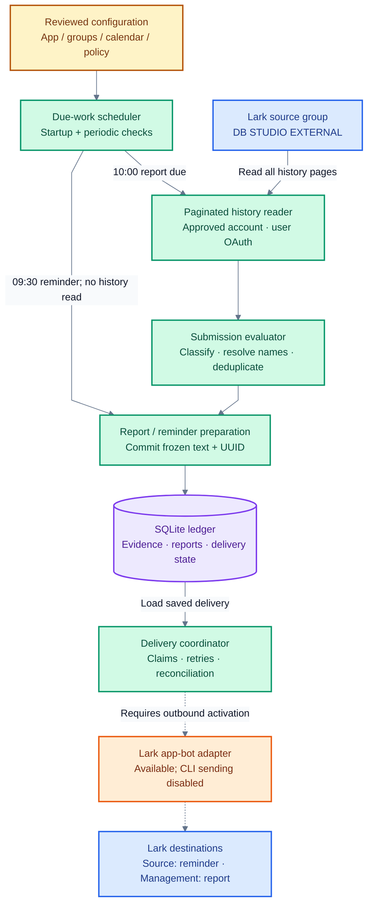
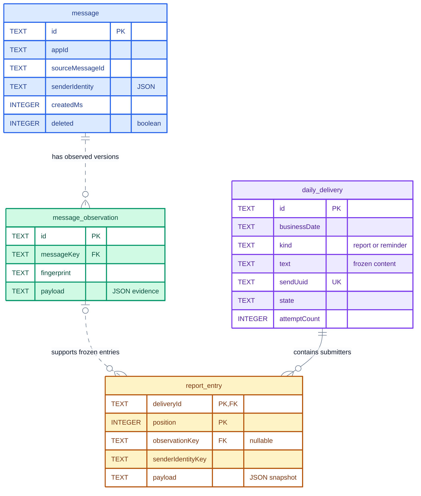

# DB Studio task-list automation

A TypeScript worker that identifies who posted a daily task list in Lark and prepares a management report. It also prepares a 09:30 reminder, using Nairobi working days and a reviewed Kenyan public-holiday calendar.

**Release status:** local development, preview and Docker acceptance are supported. The worker CLI keeps sending disabled, including when `APP_MODE=production`; `ENABLE_OUTBOUND=true` is rejected. Production access, worker OAuth provisioning, live acceptance and deployment remain pending. See the [operator runbook](RUNBOOK.md#deferred-live-acceptance).

## Table of contents

- [Project overview](#project-overview)
- [System design](#system-design)
  - [Architecture](#architecture)
  - [How the workflow runs](#how-the-workflow-runs)
  - [Delivery and recovery](#delivery-and-recovery)
- [Database design](#database-design)
  - [Tables](#tables)
  - [Entity relationships](#entity-relationships)
  - [Constraints and durability](#constraints-and-durability)
- [Tech stack](#tech-stack)
- [Installation and setup](#installation-and-setup)
- [Usage and operations](#usage-and-operations)
- [Development and verification](#development-and-verification)
- [Code map](#code-map)

## Project overview

The workflow replaces manually checking **DB STUDIO EXTERNAL** and compiling the names of people who submitted their task lists. The management report contains a dated, numbered list of distinct submitters; it does not summarise their tasks or determine who failed to submit from an employee roster.

| When, in `Africa/Nairobi` (UTC+3) | Work |
| --- | --- |
| Monday–Friday, excluding reviewed Kenyan public holidays | Eligible working days |
| 09:30 to just before 10:00 | Prepare the reminder for the source group; allow same-day catch-up |
| At or after 10:00 | Read that day's messages originally sent from midnight through **10:00 inclusive**, then freeze the management report |
| Startup and after each completed check | Recover today's unfinished work; default delay is 60 seconds |

Only supported text and rich-text task lists posted in the main conversation count. Thread replies are excluded in v1. The reader uses the latest content it observes during compilation; it does not reconstruct what an edited message looked like exactly at 10:00.

The implemented modules include classification, paginated Lark history reads, OAuth renewal, SQLite persistence, delivery claims/retries, operator reconciliation, scheduling, backup/restore and a Docker release. A private-group smoke test proved app-bot sending through the CLI; it did not establish live worker SDK operation or production group eligibility.

## System design

One Node.js worker coordinates the workflow and stores its ledger in a dedicated SQLite file. It makes outbound API requests; there is no inbound HTTP API, web framework, Redis or separate database server.

### Architecture



**Legend:** blue = Lark groups; green = worker modules; purple = persistent storage; amber = configuration; orange = outbound adapter. Dashed arrows require future activation. The coordinator records outcomes back into SQLite; that return path is omitted to keep the diagram readable.

History reads use the approved user's access because the source is an external group. Sending uses the approved app bot and explicit destination scope. Both stay bound to the same app ID; neither falls back to another account or group.

### How the workflow runs

1. **Check what is due.** Validate the Nairobi date, activation date and reviewed calendar. Prepare the reminder during its window without reading submissions. At 10:00, begin report compilation if no report is already frozen.
2. **Read every page.** Fetch the source group's midnight–10:00 history using user OAuth. Preserve message IDs, sender metadata, timestamps and supported content. Partial, denied or failed reads block compilation rather than producing an empty report.
3. **Decide who qualifies.** Normalize text/rich-text content, classify task lists, exclude late/deleted/ineligible posts and deduplicate people by `(app_id, sender_tenant_key, sender_open_id)`. Names are display data. Ambiguous candidates or unresolved qualifying names require review.
4. **Freeze a consistent report.** In one SQLite write transaction, save relevant observed evidence, the selected entries, exact report text, policy version and a stable send UUID. Either the whole report is committed or none of it is. An existing frozen report is reused; a complete, valid empty scan produces explicit zero-submission text.
5. **Deliver saved work when activated.** Claim one eligible delivery in SQLite, commit the claim, then make the Lark request outside the transaction. Record the acknowledgement or recovery state. Subsequent attempts use the saved text and UUID, without rereading or recompiling the report.

The 60-second interval is a **due-work check**, not continuous submission polling. A normal run completes one history scan per report date; blocked/incomplete scans can be retried. Restarting recovers today's work. Older missed reports are shown for reviewed backfill rather than sent automatically.

### Delivery and recovery

| State | Meaning |
| --- | --- |
| `pending` | Frozen and awaiting an attempt |
| `sending` | A worker has claimed the attempt with a bounded lease |
| `sent` | Lark acknowledgement or an evidenced operator decision is saved |
| `retryable` | A definite temporary rejection; retry after persisted backoff |
| `uncertain` | The request may have sent, or an acknowledgement could not be saved |
| `failed` | A permanent failure requiring review |

Unique delivery keys and guarded claims prevent competing workers from freely sending the same report. An expired claim becomes uncertain. The app API adapter can replay an uncertain request only within 55 minutes of the earliest attempt, using the original UUID within Lark's [documented one-hour deduplication window](https://open.larksuite.com/document/server-docs/im-v1/message/create). This reduces duplicate risk; it does not guarantee exactly-once delivery.

Reminder attempts stop at 10:00; automatic report attempts stop at the next Nairobi midnight. Outside safe retry windows, inspect and reconcile through the [runbook](RUNBOOK.md#inspect-and-recover-ordinary-work). Restored storage stays paused for review.

## Database design

The ledger has **four business tables** plus Drizzle's migration journal. [The Drizzle schema](src/storage/schema.ts) and [versioned SQL migrations](drizzle/) define the physical schema. JSON values are stored as SQLite `TEXT`; timestamps ending in `Ms` are epoch milliseconds.

### Tables

| Table | Purpose | Stored fields |
| --- | --- | --- |
| `message` | Identify a source message and its latest known lifecycle state | `id`, `appId`, `sourceChatId`, `sourceMessageId`, JSON `senderIdentity`, `createdMs`, `updatedMs`, `deleted` |
| `message_observation` | Preserve an immutable version the worker actually observed | `id`, `messageKey`, `fingerprint`, JSON `payload` with source content, normalized text, observation time and detector provenance |
| `daily_delivery` | Freeze one report or reminder and track its delivery/recovery | Identity/scope: `id`, `appId`, `businessDate`, `sourceChatId`, `destinationChatId`, `kind`, `revision`; frozen content: `policyVersion`, `text`, `sendUuid`, `timeZone`, `cutoffMs`, `textHash`; lifecycle: `state`, `messageId`, `attemptCount`, `firstAttemptMs`, `nextAttemptMs`, `adapterKind`, `claimToken`, `claimExpiresMs`, `acknowledgedMs`, `lastError`, JSON `reconciliations` |
| `report_entry` | Snapshot each distinct submitter and the exact evidence used in a report | `deliveryId`, `position`, JSON `payload` with identity/name/evidence, `observationKey`, `senderIdentityKey` |

A reminder has a `daily_delivery` record and no report entries. A zero-submission report also has no entries. Later name changes or message edits do not alter a frozen report. Observations are evidence captured by this worker, not a complete Lark edit history. Ordinary unrelated group posts are not stored as new business records.

### Entity relationships



The ERD shows selected columns; the table above lists the full schema. `PK` = primary key, `FK` = foreign key, `UK` = unique key; a circle means optional and a crow's foot means many. Entry positions form a composite primary key with `deliveryId`. New report entries link to one observation; that link remains nullable to support older records. Colours distinguish source messages (blue), observations (green), deliveries (purple) and report entries (amber).

### Constraints and durability

| Database rule | What it protects |
| --- | --- |
| Primary key `id` on `message`, `message_observation` and `daily_delivery` | A stable identifier for each record |
| `message_app_source_id`: unique `(appId, sourceMessageId)` | One source message per app scope |
| `observation_message_version`: unique `(messageKey, fingerprint)` | No duplicate observed version for a message |
| `delivery_business_key`: unique `(appId, businessDate, sourceChatId, destinationChatId, kind, revision)` | One frozen delivery per business scope/kind/revision |
| `delivery_send_uuid`: unique `sendUuid` | A distinct persisted UUID for each delivery |
| `report_entry` primary key `(deliveryId, position)` | One entry at each report position |
| `report_distinct_sender`: unique `(deliveryId, senderIdentityKey)` | No repeated non-null sender identity within one report |
| Foreign keys: observation → message; entry → delivery; entry → observation (nullable) | Referenced records must exist; deletions do not cascade |

SQLite enforces primary keys, unique indexes, `NOT NULL` columns and enabled foreign keys. State values, JSON shapes, calendar rules, scope checks and safe lifecycle transitions are validated by the application; Drizzle's TypeScript enums do **not** create SQL `CHECK` constraints. Nullable evidence/audit columns preserve migration compatibility; incomplete legacy records cannot automatically send.

Connections use WAL, `synchronous=FULL` and a five-second busy timeout. Report freezing uses an immediate transaction; network calls never hold that transaction open. Keep SQLite on dedicated local persistent storage. Review generated migrations before applying them; use the [online backup and isolated restore procedure](RUNBOOK.md#back-up-and-rehearse-restore) rather than copying an active database file.

## Tech stack

| Component | Choice | Purpose |
| --- | --- | --- |
| Runtime | Node.js **24.21.0**, TypeScript, native ES modules | Worker and operator commands |
| Package manager | pnpm **12.6.0** | Reproducible installs from the lockfile |
| Lark integration | Official `@larksuiteoapi/node-sdk` | User OAuth history reads and app-bot sending adapter |
| Persistence | SQLite via `better-sqlite3` | Local durable ledger |
| Database tooling | Drizzle ORM + Drizzle Kit | Typed queries and versioned SQL migrations |
| Verification | Vitest | Unit, HTTP contract, SQLite integration and container acceptance tests |
| Formatting / linting | Biome | Code checks |
| Packaging | Docker + Docker Compose | Non-root local release with persistent volumes |

Exact dependency versions are pinned in [package.json](package.json) and [pnpm-lock.yaml](pnpm-lock.yaml). The scheduler is application code; n8n and the server's existing PostgreSQL containers are not required.

## Installation and setup

### Local development

Use nvm and pnpm at the pinned versions. Native SQLite may require Python, `make` and a C/C++ compiler if a compatible prebuilt binding is unavailable.

From the repository root:

```bash
nvm install
nvm use
pnpm install --frozen-lockfile
cp .env.example .env
chmod 600 .env
pnpm preflight
```

Preflight checks a real in-memory SQLite/Drizzle query and SDK client construction. It makes no network requests and does not create the business ledger. It checks local compatibility, not live credentials or group access.

### Configure a preview worker

[.env.example](.env.example) lists the settings. Keep real configuration and credentials out of Git.

| Setting | Required configuration |
| --- | --- |
| `APP_MODE`, `ENABLE_OUTBOUND` | Keep `preview` and `false` |
| `BUSINESS_TIMEZONE` | `Africa/Nairobi` |
| `SQLITE_FILE_PATH` | Dedicated local preview ledger; parent directory must exist |
| `LARK_APP_ID`, `SOURCE_CHAT_ID`, `MANAGEMENT_CHAT_ID` | Approved app/group scope; the supplied management ID is a placeholder |
| `LARK_APP_SECRET`, `LARK_READER_OPEN_ID`, `LARK_USER_CREDENTIAL_FILE` | Needed by `worker run`; separate worker user-OAuth grant under the approved app/account |
| `HOLIDAY_CALENDAR_PATH`, `ACTIVATION_DATE`, `POLICY_VERSION` | Reviewed calendar covering activation through today, activation date and policy version |
| `WORKER_CHECK_INTERVAL_MS` | Delay after each completed check; default `60000` |
| `WORKER_RESTORE_MODE` | Pause work during recovery; a persistent restore marker also enforces the pause |

No approved annual holiday dataset or initial worker OAuth login command is bundled. The calendar JSON needs `version`, `fromDate`, `throughDate`, `reviewedOn`, HTTPS `sourceUrls` and `publicHolidays` dates. OAuth files require a private directory (0700) and file (0600), owned by the worker. Provision a separate grant; copying the CLI's rotating refresh token can disrupt its session. See [preview configuration](RUNBOOK.md#configure-an-isolated-preview) and [credential recovery](RUNBOOK.md#stop-replace-and-roll-back).

For Docker builds, acceptance, volume preparation and startup, follow the [runbook](RUNBOOK.md#build-and-exercise-the-local-image). The supplied Compose package is offline, publishes no ports and forces sending off. A due report that needs Lark remains blocked offline.

## Usage and operations

After configuring the preview and creating its database directory:

```bash
pnpm worker run --once
pnpm worker status
pnpm worker run
```

`run --once` performs one due check; `run` checks at startup and then waits the configured interval after each check. They may read Lark and freeze preview records, but do not send. The ledger opens with packaged migrations. `status` needs an existing migrated ledger and reviewed calendar/scope configuration, but no SDK credentials or Lark connection.

Inspect a frozen delivery locally:

```bash
pnpm delivery status --id <delivery-id>
```

| Operation | Guide |
| --- | --- |
| Inspect work and reconcile an uncertain delivery | [Delivery review](RUNBOOK.md#inspect-and-recover-ordinary-work) |
| Take a consistent backup or rehearse an isolated restore | [Backup and restore](RUNBOOK.md#back-up-and-rehearse-restore) |
| Stop, replace or roll back the container | [Release recovery](RUNBOOK.md#stop-replace-and-roll-back) |
| Validate access and prepare future activation | [Deferred live acceptance](RUNBOOK.md#deferred-live-acceptance) |

Unresolved reads or candidates are not valid zero-submission days. Leave uncertain sends unresolved until evidence supports a decision; reconciliation itself never sends. Retention/pruning, off-server backup scheduling, restore release and production activation are not configured. The manual management list remains the fallback.

## Development and verification

```bash
pnpm test
pnpm typecheck
pnpm lint
pnpm build
```

Focused checks:

```bash
pnpm test:contract
pnpm test:integration
pnpm release:build
pnpm test:release
```

Tests use synthetic data, temporary real SQLite files and controlled HTTP fixtures; they need no live Lark credentials or messages. Docker acceptance requires local Docker access and runs separately from the ordinary suite. See the [runbook](RUNBOOK.md#build-and-exercise-the-local-image) for optional rollback acceptance.

Generate schema changes with `pnpm db:generate`, review and commit the SQL/snapshot, then migrate isolated storage with `pnpm db:migrate` using the intended `SQLITE_FILE_PATH`. Do not use schema push against production.

Each phase/slice starts on its own branch from current `main`. Use coherent, purpose-focused commits and merge after review. Local plans, design specs, research, dependencies, build output, databases, backups and secrets are intentionally ignored; the README, runbook, migrations and sanitized environment template are tracked.

## Code map

| File | Responsibility |
| --- | --- |
| [src/evaluate-submissions.ts](src/evaluate-submissions.ts) | Task-list classification, names and distinct sender selection |
| [src/submission-history.ts](src/submission-history.ts) | Paginated, bounded Lark history reads |
| [src/user-oauth-credentials.ts](src/user-oauth-credentials.ts) | Private saved grants and durable OAuth renewal |
| [src/report-ledger.ts](src/report-ledger.ts) | Evidence, report freezing, claims, retries and reconciliation |
| [src/storage/schema.ts](src/storage/schema.ts) | Drizzle table definitions |
| [src/lark-delivery.ts](src/lark-delivery.ts) | Scoped app-bot HTTP adapter |
| [src/due-worker.ts](src/due-worker.ts) | Working-day scheduling and recovery decisions |
| [src/worker-command.ts](src/worker-command.ts), [src/delivery-command.ts](src/delivery-command.ts), [src/storage-command.ts](src/storage-command.ts) | Operator interfaces |
| [Dockerfile](Dockerfile), [compose.yaml](compose.yaml) | Local image and container configuration |
